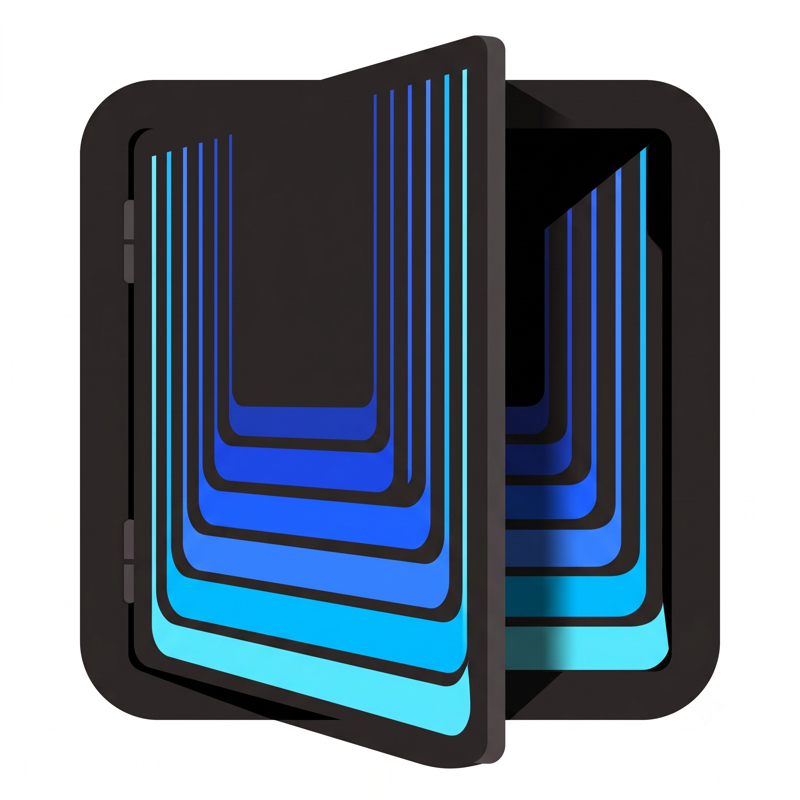

<p align="center">
  
</p>

# solopen

Open (or create) the Solo project for a directory, from the shell.

```sh
solopen [--force] <directory>
```

Resolves the directory to a Solo project and brings it up in Solo.app:

1. **Exact match** — a registered project whose path equals the directory (after `realpath`).
2. **Deepest ancestor** — the registered project furthest down the tree that contains the directory. 
   Catch-all projects on the ignore-list (currently just `$HOME`, the `~` project) never ancestor-match, though they still open via exact match.
3. **Create** — registers a new project named after the directory's basename, rooted at the literal directory (never the enclosing git root), then opens it.
   If registered projects already exist *beneath* the directory the create is refused and they are listed; `--force` creates anyway.

If Solo.app isn't running it is launched and polled until the CLI answers (`SOLO_LAUNCH_TIMEOUT` seconds, default 15). 
If the app is running but its local API is unreachable, local CLI access is off in Solo's settings — the script says so immediately instead of polling.

Installed on PATH via `~/bin/solopen → ~/Projects/solopen/solopen`.
`~/bin/solo-cli → /Applications/Solo.app/Contents/MacOS/solo-cli` exposes the bundled CLI the script shells out to (override with `SOLO_CLI`). 
Requires **local CLI access** enabled in Solo's settings; the script says so when it isn't. 

## Development

Tests use [shellspec](https://shellspec.info/), installed via mise (`mise.toml`):

```sh
mise exec -- shellspec
```
